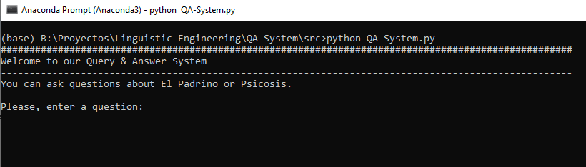
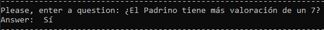

# Question-Answer System

Question-answer systems are a type of system within the Information Retrieval and Extraction fields in charge of automatically answering natural language questions asked by users. Within this type of system, we can distinguish two classes:
+ **Question-Answer in a closed domain**: it consists of building a system capable of answering questions for a specific domain, being unable to answer questions that are outside the domain.
+ **Question-Answer in an open domain**: it consists of building a system capable of answering questions about practically anything. To build these systems it is necessary to use very large datasets.

In this project we implement a Question-Answer System in a closed domain.

## Project structure

+ In the subfolder ``/documents`` are the two documents that we will analyze to create our system.
+ The summaries of the questions and answers will be saved in the subfolder ``/answers``.
+ In the subfolder ``/src`` you can find all the code files of the implementation of our system.
+ Finally, the document ``gabarre_garcia_qa_system.pdf``, that is the report of this project.

## Our application

### Example

Below we can see how our system is able to answer the question *Did El Padrino obtain more than 7 of valoration?*

